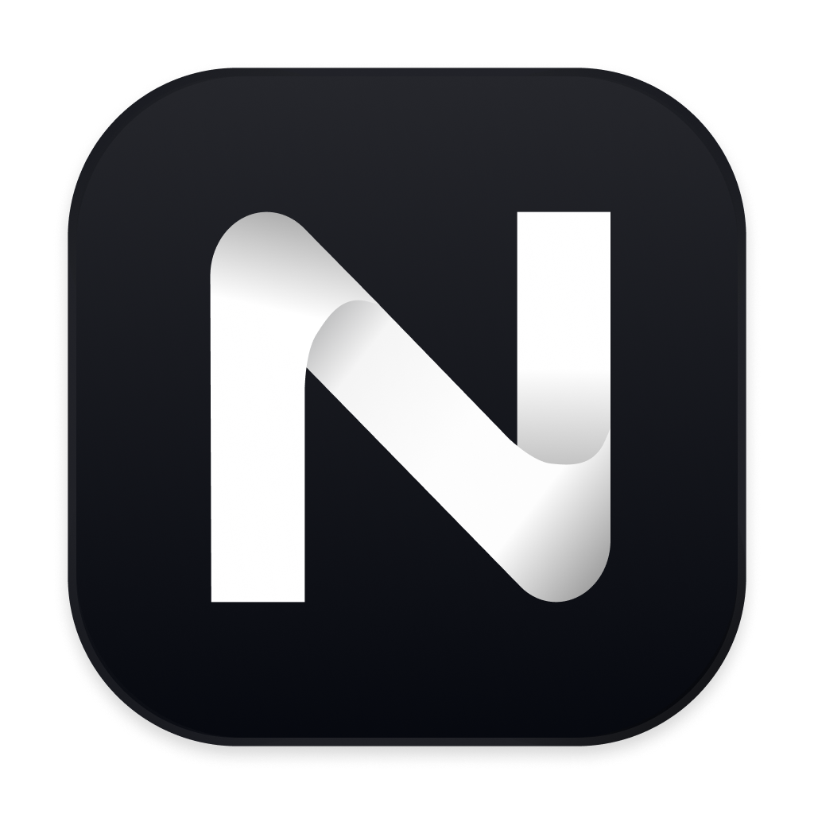
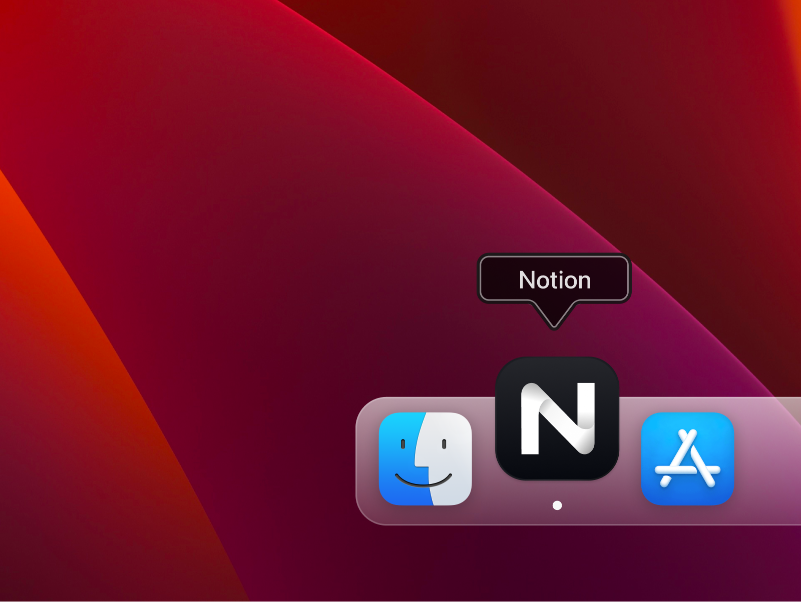

<!-- Improved compatibility of back to top link: See: https://github.com/othneildrew/Best-README-Template/pull/73 -->
<a id="readme-top"></a>
<!--
*** Thanks for checking out the Best-README-Template. If you have a suggestion
*** that would make this better, please fork the repo and create a pull request
*** or simply open an issue with the tag "enhancement".
*** Don't forget to give the project a star!
*** Thanks again! Now go create something AMAZING! :D
-->


<!-- PROJECT SHIELDS -->
<!--
*** I'm using markdown "reference style" links for readability.
*** Reference links are enclosed in brackets [ ] instead of parentheses ( ).
*** See the bottom of this document for the declaration of the reference variables
*** for contributors-url, forks-url, etc. This is an optional, concise syntax you may use.
*** https://www.markdownguide.org/basic-syntax/#reference-style-links
-->
[![Forks][forks-shield]][forks-url]
[![Stargazers][stars-shield]][stars-url]
[![Issues][issues-shield]][issues-url]
[![MIT License][license-shield]][license-url]
[![LinkedIn][linkedin-shield]][linkedin-url]


<!-- PROJECT LOGO -->
<br />
<div align="center">
  <a href="https://github.com/remondevries/notion-restyled">
    
    <p></a></p>
  </a>

  <p align="center">
    A cleaner design for your Notion Application Icon
    <br />
    <br />
    <a href="https://github.com/remondevries/notion-restyled/issues/new?labels=bug&template=bug-report---.md">Report Bug</a>
    ·
    <a href="https://github.com/remondevries/notion-restyled/issues/new?labels=enhancement&template=feature-request---.md">Request Feature</a>
  </p>
</div>

<!-- ABOUT THE PROJECT -->
## About The Project



I have been working on my Notion dashboards, and because I put so much time and energy into it, I thought it deserved a redesign for the dock icon. So I spent some time working on this concept. Maybe in the future, I will work on it some more, but as of right now, I'm happy.
I took inspiration from [@jinks908](https://macosicons.com/#/?icon=2q0Hf4763k) but wanted a bit more of a darker look and a more balanced design.

<p align="right">(<a href="#readme-top">back to top</a>)</p>

<!-- INSTALLATION -->
## Installation

This guide will walk you through the process of changing the icon for both Windows and macOS applications. Changing the application icon can enhance your application's branding and improve user experience.

### Prerequisites

Before you begin, ensure you have the following:

-  An icon file in the appropriate format:
  - Windows: `.ico`
  - macOS: `.icns`
-  Access to the application's source code or project files

## Changing the Icon on Windows

### Step 1: Prepare Your Icon File

1. **Create or Obtain an Icon**: If you don't have an icon yet, you can create one using tools like [GIMP](https://www.gimp.org/) or [IcoFX](https://icofx.ro/). Alternatively, you can find free icons on websites like [Flaticon](https://www.flaticon.com/) or [Icons8](https://icons8.com/).
   
2. **Save the Icon**: Make sure your icon is saved in the `.ico` format.

### Step 2: Replace the Existing Icon

1. **Locate Your Project Directory**: Open your project directory where your application files are stored.

2. **Find the Current Icon File**: Look for the existing icon file, usually named `app.ico`, `icon.ico`, or something similar. 

3. **Replace the Icon**: 
   - Rename your new icon file to match the name of the existing icon file.
   - Copy your new icon file into the project directory, replacing the old icon file.

### Step 3: Update the Application Manifest (if necessary)

1. **Open the Manifest File**: Locate and open your application's manifest file.

2. **Update Icon Reference**: Look for the `<application>` section and ensure the icon reference points to your new icon file:

   ```xml
   <application>
       <windowsSettings>
           <defaultIcon>
               <file>icon.ico</file>
           </defaultIcon>
       </windowsSettings>
   </application>
   ```

### Step 4: Rebuild Your Application
1. Open Your Development Environment: Launch your IDE (like Visual Studio).
2. Rebuild the Project: Use the rebuild option in your IDE to compile your application with the new icon.

### Step 5: Test the Application
1. Run Your Application: After rebuilding, run your application to ensure that the new icon appears correctly.
2. Check the Taskbar and Desktop: Verify that the icon displays correctly in both the taskbar and on the desktop.

## Changing the Icon on macOS

### Step 1: Prepare Your Icon File
1. Create or Obtain an Icon: If you don't have an icon yet, you can create one using tools like Icon Slate or Image2Icon. Alternatively, you can find free icons on websites like Flaticon or Icons8.
2. Save the Icon: Make sure your icon is saved in the .icns format.

### Step 2: Replace the Existing Icon
1. Locate Your Project Directory: Open your project directory where your application files are stored.
2. Find the Current Icon File: Look for the existing icon file, usually named app.icns, icon.icns, or something similar.
3. Replace the Icon:
	▪	Rename your new icon file to match the name of the existing icon file.
	▪	Copy your new icon file into the project directory, replacing the old icon file.

### Step 3: Update the Application Bundle (if necessary)
1. Open the Application Bundle: Right-click on your application in Finder and select "Show Package Contents."
2. Locate the Info.plist File: Navigate to the Contents folder and find the Info.plist file.
3. Edit the Info.plist File: Open the Info.plist file in a text editor or Xcode. Look for the following key:

```xml
  <key>CFBundleIconFile</key>
  <string>icon.icns</string>
```

Ensure the value matches the name of your new icon file (without the .icns extension).

### Step 4: Rebuild Your Application
1. Open Your Development Environment: Launch your IDE (like Xcode).
2. Rebuild the Project: Use the rebuild option in your IDE to compile your application with the new icon.

### Step 5: Test the Application
1. Run Your Application: After rebuilding, run your application to ensure that the new icon appears correctly.
2. Check the Dock and Finder: Verify that the icon displays correctly in both the Dock and Finder.

## Conclusion
Congratulations! You have successfully changed the icon for your Windows and macOS applications. If you have any questions or run into issues, feel free to open an issue in this repository.
Additional Resources

- Creating Icons for Windows Applications
- Creating Icons for macOS Applications
- Icon Design Guidelines


<p align="right">(<a href="#readme-top">back to top</a>)</p>

<!-- CONTRIBUTING -->
## Contributing

Contributions are what make the open source community such an amazing place to learn, inspire, and create. Any contributions you make are **greatly appreciated**.

If you have a suggestion that would make this design better, please fork the repo and create a pull request. You can also simply open an issue with the tag "enhancement".
Don't forget to give the project a star! Thanks again!

1. Fork the Project
2. Create your Feature Branch (`git checkout -b feature/AmazingFeature`)
3. Commit your Changes (`git commit -m 'Add some AmazingFeature'`)
4. Push to the Branch (`git push origin feature/AmazingFeature`)
5. Open a Pull Request

<p align="right">(<a href="#readme-top">back to top</a>)</p>

<!-- LICENSE -->
## License

Distributed under the MIT License. See `LICENSE.txt` for more information.

<p align="right">(<a href="#readme-top">back to top</a>)</p>


<!-- CONTACT -->
## Contact

Remon - [@remondevries](https://twitter.com/remondevries) - hello@remondevries.com

Project Link: [https://github.com/remondevries/notion-restyled](https://github.com/remondevries/notion-restyled)

<p align="right">(<a href="#readme-top">back to top</a>)</p>


<!-- ACKNOWLEDGMENTS -->
## Acknowledgments

* [jinks908](https://macosicons.com/#/?icon=2q0Hf4763k)

<p align="right">(<a href="#readme-top">back to top</a>)</p>


<!-- MARKDOWN LINKS & IMAGES -->
<!-- https://www.markdownguide.org/basic-syntax/#reference-style-links -->
[forks-shield]: https://img.shields.io/github/forks/remondevries/notion-restyled.svg?style=for-the-badge
[forks-url]: https://github.com/remondevries/notion-restyled/fork
[stars-shield]: https://img.shields.io/github/stars/remondevries/notion-restyled.svg?style=for-the-badge
[stars-url]: https://github.com/remondevries/notion-restyled/stargazers
[issues-shield]: https://img.shields.io/github/issues/remondevries/notion-restyled.svg?style=for-the-badge
[issues-url]: https://github.com/remondevries/notion-restyled/issues
[license-shield]: https://img.shields.io/github/license/remondevries/notion-restyled.svg?style=for-the-badge
[license-url]: https://github.com/remondevries/notion-restyled/blob/main/LICENSE
[linkedin-shield]: https://img.shields.io/badge/-LinkedIn-black.svg?style=for-the-badge&logo=linkedin&colorB=555
[linkedin-url]: https://www.linkedin.com/in/remondevries
[product-screenshot]: images/screenshot.png
